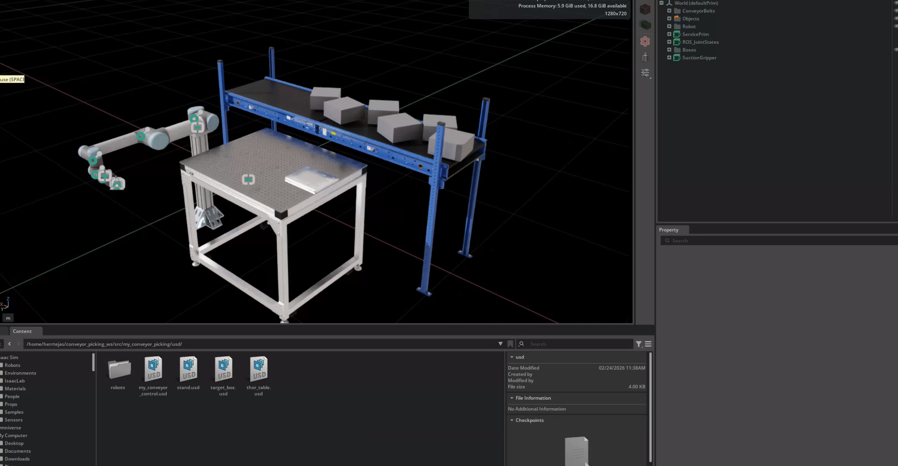
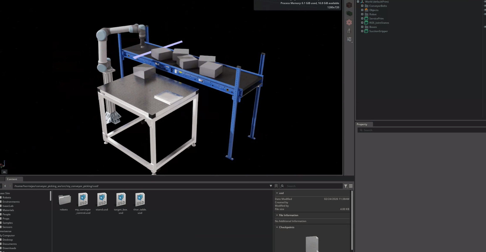
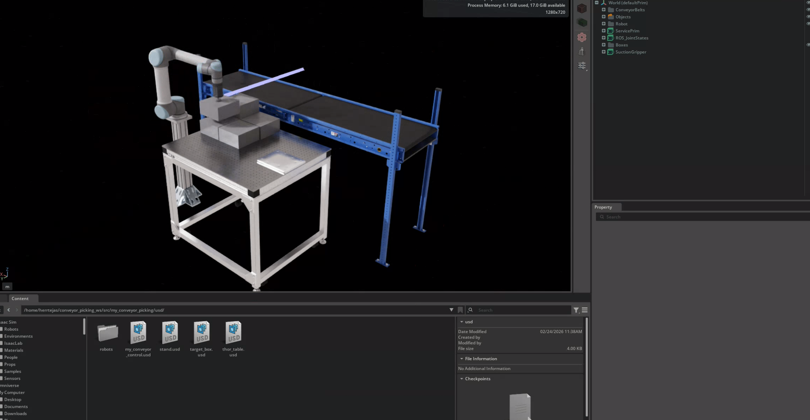

# 🏭 Automated Palletizing System

An end-to-end robotic palletizing simulation using **NVIDIA Isaac Sim** and **ROS2 Jazzy** that autonomously detects, picks, and stacks boxes from a conveyor line.



## 🎯 Overview

This project simulates a real-world warehouse palletizing operation where a UR5 robot arm picks boxes from a conveyor belt and stacks them in an organized pile.

### How It Works

1. Boxes travel on dual conveyor belts
2. Lightbeam sensor detects box arrival and stops the conveyor
3. System waits for the box to fully stop
4. UR5 computes pick pose relative to robot base
5. 7-step motion sequence executes: **approach → pick → lift → move → place → release → retract**
6. Conveyor restarts automatically for the next box
7. Boxes stack neatly in a 2×2×2 pattern

## 🛠️ Tech Stack

| Component | Technology |
|-----------|------------|
| Simulation | NVIDIA Isaac Sim 5.1.0 |
| Middleware | ROS2 Jazzy |
| OS | Ubuntu 24.04 |
| Language | Python 3.11 |
| DDS | Cyclone DDS |
| GPU | NVIDIA RTX 5070 |

## 📁 Project Structure

```
conveyor_picking_ws/
├── src/
│   ├── my_conveyor_picking/
│   │   ├── my_conveyor_picking/
│   │   │   ├── lightbeam_conveyor_stop.py   # Sensor detection & conveyor control
│   │   │   ├── palletizing_server.py        # Pick-and-place action server
│   │   │   ├── ur5_controller_server.py     # Robot trajectory execution
│   │   │   ├── world_transform_resolver.py  # Coordinate transformations
│   │   │   └── helper_functions/
│   │   │       ├── inv_kin.py               # Inverse kinematics solver
│   │   │       ├── pile_calculator.py       # Stacking position calculator
│   │   │       └── transformations.py       # Pose transformations
│   │   ├── config/
│   │   │   ├── params.yaml                  # Robot & palletizing parameters
│   │   │   └── conveyor_params.yaml         # Conveyor & sensor settings
│   │   ├── launch/
│   │   │   └── palletizing.launch.py        # Main launch file
│   │   └── usd/
│   │       └── my_conveyor_control.usd      # Isaac Sim scene
│   ├── isaac_ros2_messages/                 # Custom ROS2 service definitions
│   └── palletizing_interfaces/              # Custom action definitions
└── open_isaac_sim.sh                        # Isaac Sim launcher script
```

## ⚙️ Features

- **ROS2 Action Architecture**: Robot and conveyor communicate through ROS2 actions (request → execute → respond)
- **Real-time Sensing**: Lightbeam sensor detects boxes and triggers the pick sequence
- **Velocity Monitoring**: System waits for box to fully stop before picking
- **Auto Orientation Correction**: Gripper adjusts rotation so boxes land straight on the pile
- **Configurable Stacking**: Pile pattern configurable via YAML parameters
- **Suction Gripper**: Simulated vacuum gripper for box handling

## 🚀 Installation

### Prerequisites

- Ubuntu 24.04
- ROS2 Jazzy
- NVIDIA Isaac Sim 5.1.0
- Python 3.11
- NVIDIA GPU (RTX series recommended)

### Setup

1. **Clone the repository**
   ```bash
   git clone https://github.com/HerrTejas/isaac-sim-palletizing.git
   cd isaac-sim-palletizing
   ```

2. **Create Python virtual environment**
   ```bash
   python3.11 -m venv ~/isaacsim_env
   source ~/isaacsim_env/bin/activate
   pip install isaacsim[all]==5.1.0 --extra-index-url https://pypi.nvidia.com
   ```

3. **Build the workspace**
   ```bash
   cd conveyor_picking_ws
   colcon build
   source install/setup.bash
   ```

4. **Set environment variables**
   ```bash
   export OMNI_KIT_ACCEPT_EULA=YES
   export RMW_IMPLEMENTATION=rmw_cyclonedds_cpp
   ```

## 📖 Usage

1. **Launch Isaac Sim**
   ```bash
   cd ~/conveyor_picking_ws/src
   ./open_isaac_sim.sh
   ```

2. **Load the scene**
   - In Isaac Sim: File → Open
   - Navigate to `my_conveyor_picking/usd/my_conveyor_control.usd`

3. **Press Play** in Isaac Sim

4. **Launch the ROS2 nodes** (in a new terminal)
   ```bash
   source /opt/ros/jazzy/setup.bash
   source ~/conveyor_picking_ws/install/setup.bash
   export RMW_IMPLEMENTATION=rmw_cyclonedds_cpp
   ros2 launch my_conveyor_picking palletizing.launch.py
   ```

5. Watch the robot autonomously pick and stack boxes!

## ⚡ Configuration

Key parameters in `config/params.yaml`:

```yaml
palletizing_server:
  ros__parameters:
    trajectory_time_slow: 5          # Seconds for slow movements
    trajectory_time_fast: 2          # Seconds for fast movements
    safe_approach_height: 0.3        # Height above box for approach
    gripper_contact_height: 0.045    # Height where gripper contacts box
    box_size: [0.2, 0.2, 0.1]        # Box dimensions [x, y, z] meters
    box_x_count: 2                   # Boxes per row
    box_y_count: 2                   # Boxes per column
    box_z_count: 2                   # Number of layers
```

## 🎥 Demo

| Boxes on Conveyor | Robot Picking | Stacked Pile |
|:-----------------:|:-------------:|:------------:|
|  |  |  |

## 🙏 Acknowledgments

- [Caio Viturino](https://www.linkedin.com/in/caio-viturino/) for excellent instruction on Isaac Sim + ROS2 integration
- NVIDIA for Isaac Sim platform
- Open Robotics for ROS2

## 📄 License

This project is licensed under the BSD-2.0 License - see the [LICENSE](LICENSE) file for details.

## 📬 Contact

**Tejas Murkute**
- LinkedIn: [linkedin.com/in/tejasmurkute](https://linkedin.com/in/tejasmurkute)
- GitHub: [@HerrTejas](https://github.com/HerrTejas)
- Portfolio: [herrtejas.github.io](https://herrtejas.github.io)
